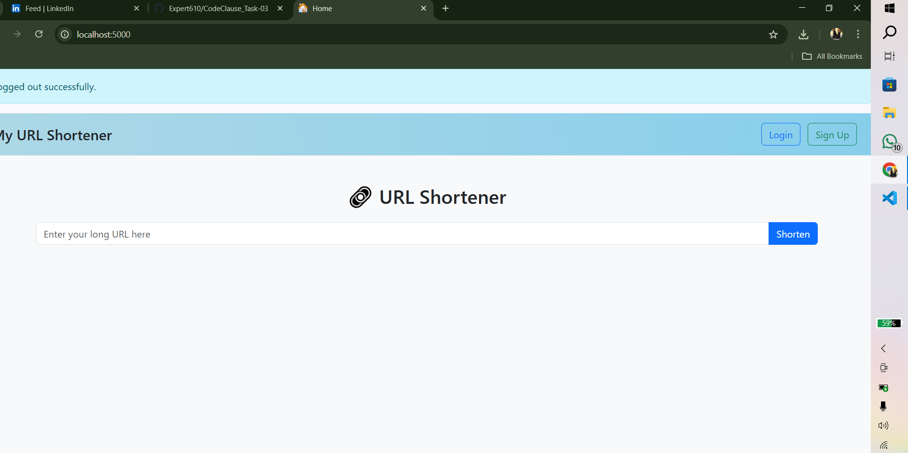
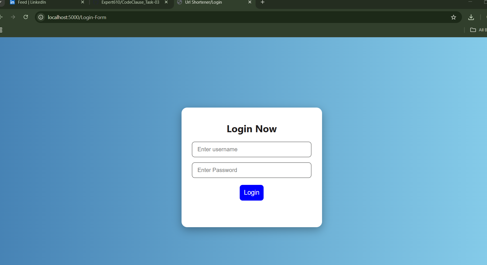
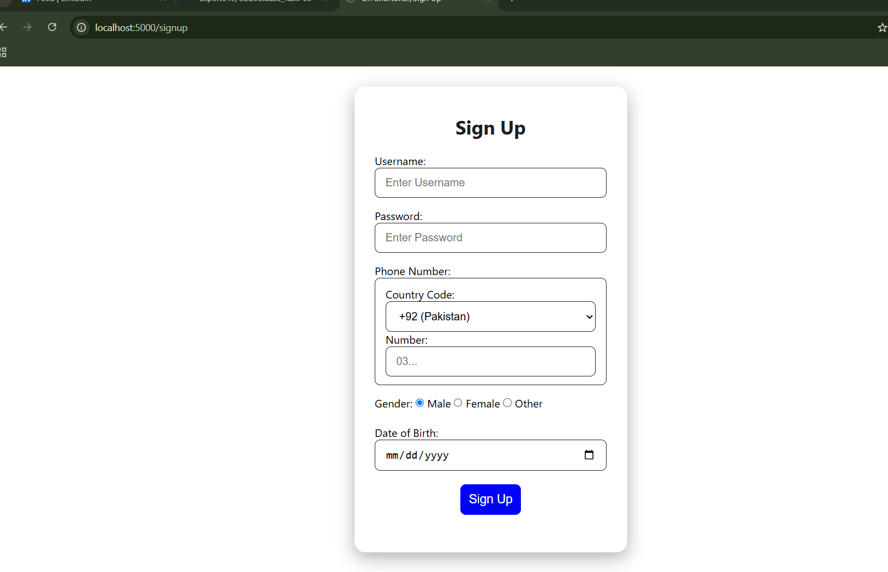
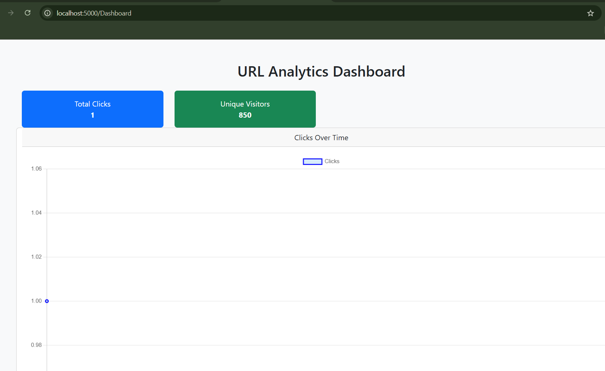

# 🚀 My URL Shortener

A fully functional **Advanced URL Shortener** web application built with Flask. This app allows users to shorten long URLs, manage them through a personalized dashboard, and includes user authentication (sign up, login, logout) with session management. All data is stored using **SQLite**, making it lightweight and easy to set up.

---

## 📸 Screenshot

  











---

## 🔑 Features

- 🔗 **URL Shortening** – Convert long links into short, shareable URLs.
- 👤 **User Authentication** – Sign up, login, and logout securely.
- 🧑‍💼 **Dashboard** – Personalized dashboard showing all shortened URLs per user.
- 📊 **Click Counter** – Count the number of times each URL was clicked.
- 💾 **SQLite Database** – Lightweight and built-in Python database for storing users and URLs.
- 🔐 **Session Handling** – Keeps users logged in across pages.
- 🌐 **Responsive UI** – Clean and user-friendly interface.

---

## 🛠️ Technologies Used

- **Python 3**
- **Flask** (Backend framework)
- **SQLite** (Database)
- **Bootstrap 5** (For responsive front-end)
- **Jinja2** (Template engine)

---

## 📂 Project Structure
  MyURLShortener/
│
├── app.py # Main Flask app
├── database.db # SQLite database file
├── templates/ # HTML templates (index, login, signup, dashboard)
│ ├── index.html
│ ├── login.html
│ ├── signup.html
│ └── dashboard.html
├── static/ 
│ ├── style.css
│ └── screenshot.png
├── README.md # Project documentation


---

## 🔧 Setup Instructions

1. **Clone the repository**
   ```bash
   git clone https://github.com/Expert610/CodeClause_Task-03.git
   cd ...


   http://127.0.0.1:5000/


👨‍💻 Author
Name: Muhammad Yasir
GitHub: Expert610
Email: yaisikhan111@gmail.com
Country: Pakistan

💡 Future Enhancements
📈 Analytics dashboard with click trends

📅 URL expiry option

📧 Email-based authentication

🔗 Custom short link option

